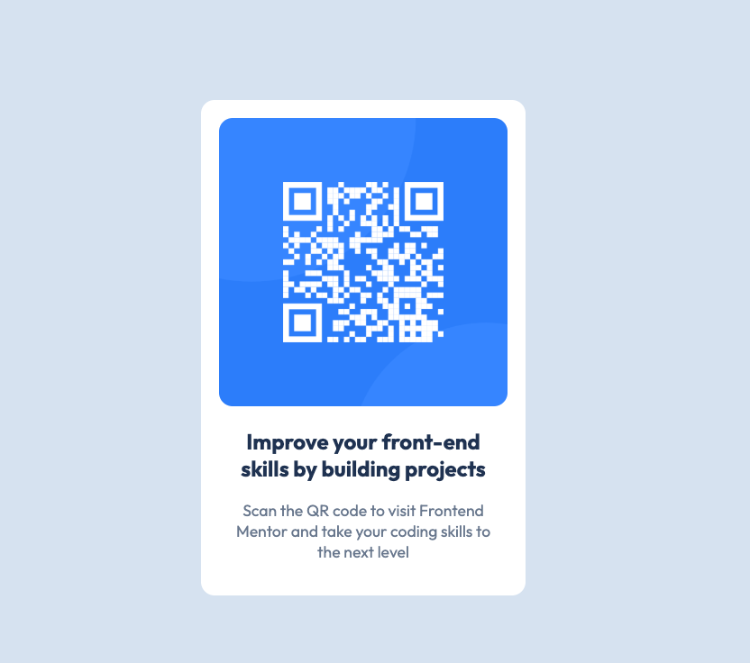

# Frontend Mentor - QR Code Component

## HTML Best Practices

### Semantic Structure

- The HTML is structured with meaningful elements like `<main>`, `<section>`, and `<article>`, ensuring the content is both easy to read and accessible.
- The structure supports both developers and screen readers.

### Accessibility

- The use of descriptive alt text for images enhances accessibility, ensuring that all users, including those with visual impairments, understand the content.
- Links that open in a new tab (`target="_blank"`) also include `rel="noopener noreferrer"` for security and performance.

### Responsive Design

- The page layout is fully responsive, utilizing the viewport meta tag for proper scaling on different devices and ensuring a smooth experience across screen sizes.

## CSS Best Practices

### CSS Variables

- Custom properties (e.g., `--white`, `--slate-300`) are used throughout the CSS for consistent design, making it easier to manage and update the color scheme and other properties globally.

### Font Styling

- Custom fonts are loaded efficiently, and typography is handled with appropriate font weights and optical sizing to improve readability and design consistency.

### Flexbox Layout

- Flexbox is used to create a centered layout that adapts well to different screen sizes, ensuring the design is flexible and responsive.

### BEM Methodology

- The use of the BEM (Block, Element, Modifier) naming convention makes the CSS highly maintainable and modular.
  - Class names like `.card`, `.card__content`, and `.card__image` improve the clarity and scalability of the project.

### Performance Optimizations

- Critical resources, such as Google Fonts, are preloaded for faster load times, and images are lazy-loaded to improve performance.

### Mobile Optimization

- The layout is fully optimized for mobile devices, using `rem` units for flexible, responsive design that adjusts based on the user's device.

## User Experience Enhancements

### Hover Effects

- Subtle hover effects, such as box shadows and transformations, have been added to interactive elements, enhancing the user experience and providing visual feedback on user actions.

### Security

- All external links open in a new tab with `rel="noopener noreferrer"`, ensuring better security and preventing potential security risks.
